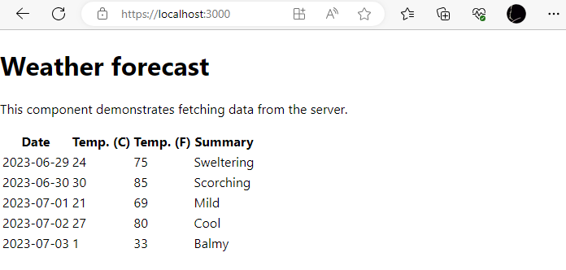
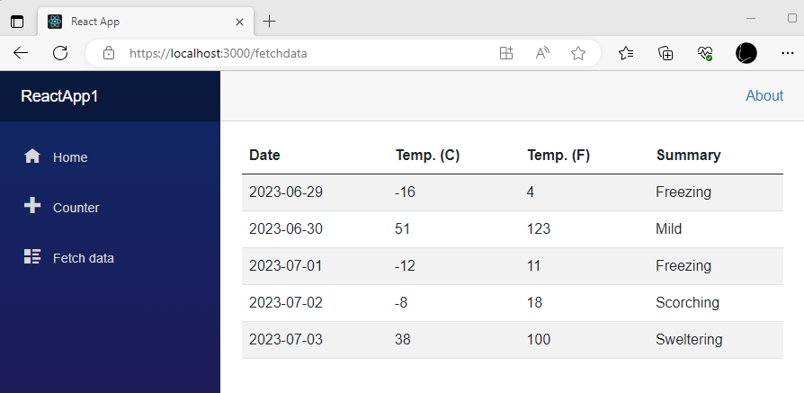

# Introduction
This is a solution template that extends the "React and ASP.NET Core (Preview)" .NET 7 template that comes with Visual Studio.

That template sets up the client side under the nice new esproj project type which makes doing the front end from full Visual Studio a bit friendlier.

The front end is based on Create React App with the Webpack Dev Server proxy configured for forward requests on to the .NET Web API

# Whats's been added

## Tech changes

Before

* React (JavaScript)
* Rest API (Web API)

After

* React (TypeScript)
* React Router
* GraphQL API (Apollo client + Codegen + HotCocolate server)
* Entity Framework

## UI changes

Where as the template at the moment just has a plain page that gets the list of weather forecasts.



The UI from the template Blazor app has been added along with client side routing to switch between views.



# Notes

One of the tricky parts I came across was that in the template Blazor app it showcases the CSS isolation features built into Blazor/Razor. Here if you follow the naming convention

```
├── MyComponent.razor
├── MyComponent.razor.css
```
The framework will isolate the css in that file so that it only applies to that component.

Create React App has built in support for something similar - CSS modules. Again there is a naming convention then a slightly different syntax for importing / applying styles in your component. However the way they are implemented is slightly different. 

The Blazor implementation will generate attributes against your components HTML elements and then re-write your css to only apply the styles to elements with those attributes. The CRA implementation generates a hash for each style and then you get an object with the hashes you can use to apply uniquely to elements in your component.

However because you are no longer applying the original class name it doesn't play so nicely when you are overriding vendor supplied styles, E.G. Bootstrap.

The quick fix for this I applied was the CssModuleNameComposer class which will take a list of unadulterated class names and return the className string including any CSS module hashes that have been defined for that class name.


```
Example Input: ["page"]

Example Output "page Layout_page__M3sKN"
```

# Appendix

Here are the resources I used to help figure this out:

[Full-Stack React and .NET with GraphQL](https://blog.devgenius.io/full-stack-react-and-net-with-graphql-a1bd615c05a0)

[ASP.NET Core Blazor CSS isolation](https://learn.microsoft.com/en-us/aspnet/core/blazor/components/css-isolation?view=aspnetcore-7.0)

[Create React App - Adding a CSS Modules Stylesheet](https://create-react-app.dev/docs/adding-a-css-modules-stylesheet/)
